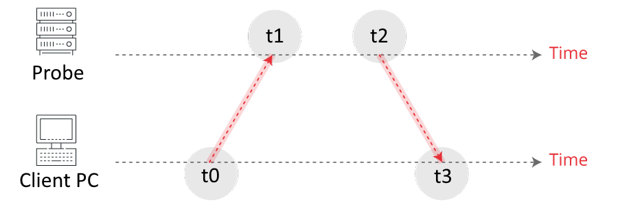

# Lacuna Dev Admission - LacunaSpace

My solution to [@LacunaSoftware](https://github.com/LacunaSoftware) 2024 technical test.

## 1. Intro

Lacuna Software just started a fictitious branch: **Lacuna Space**

We’ve deployed a clock synchronizing project for monitoring probes across the Solar System called **Luma**.

Time synchronization between computers in a network or with the probes running experiments is a basic requirement to ensure cohesive communication and data transfer.

Your job is to follow the documentation below and create a **C# .Net** program which communicates with our APIs, sync your local clock with each space probe clock and help our systems to also sync with and monitor it.

Once you start the test, you have 7 days to complete it.

After completed, send us your **final project code** in a ZIP file and your **Resume (Curriculum)** to admissions@lacunasoftware.com.

This test shall be done individually and in private. **Do not upload your project or solution to public code repositories**, such as github or gitlab.

If you have any questions during the test, please contact us at same email address.

>This is not a race! Make sure you show your coding skills, knowledge on modularization, data serialization and code reuse.
>
>Failing is an essential part of the process.
>
>Have fun!

## 2. Start

The first step is to call the start API, creating a test context and receiving an ``accessToken`` for communicating with Luma.

For every API, the Luma base address is:
``Base address: https://luma.lacuna.cc/``

and all requests and responses types are:
``Content-Type: application/json``

All API responses should have HTTP status code 200 and share the base parameters:

```csharp
BaseResponse:
{
  code: string,
  message?: string // response details message (if any)
}
```

### Start API

```csharp
'[POST] /api/start'
Request:
{
  username: string, // your username
  email: string // your email address so we are able to contact you
}

Response:
{
  accessToken?: string,
  code: string, // ['Success', 'Error']
  message?: string // response details message (if any)
}
```

If everything is OK, you will receive a ``'Success'`` response code and an ``accessToken`` string.

The access token shall be used in the Authorization Header parameter as an OAuth bearer token scheme for the next APIs:
``Authorization: Bearer {accessToken}``

The access token is valid **for 2 minutes**. If expired, the authenticated APIs will return an ``'Unauthorized'`` response code.

If you receive an ``'Unauthorized'`` or ``'Fail'`` code on any API response, you need to start a new test context.

## 3. List Probes

The next step is to list the probes info

```csharp
'[GET] /api/probe'
Headers:

-  Authorization: Bearer {accessToken}

Response:
{
  probes?: Probe[],
  code: string, // ['Success', 'Error', 'Unauthorized']
  message?: string
}

Probe:
{
  id: string,
  name: string,
  encoding: string
}
```

## 4. Timestamp

The timestamp unit that must be used is the [Ticks](https://learn.microsoft.com/en-us/dotnet/api/system.datetimeoffset.ticks?view=net-7.0) from ``DateTimeOffset.UtcNow.Ticks`` which represents a 100-nanoseconds precision timestamp in [UTC](https://en.wikipedia.org/wiki/Coordinated_Universal_Time) (without time zone offset).

### Timestamp Encodings

Each probe uses different encoding for representing it’s timestamp. The encoding type is returned in the probe info ``encoding`` parameter and the types are:

```csharp
'Iso8601', // ticks based on the ISO datetime string format: yyyy-MM-ddTHH:mm:ss.FFFFFFFzzz
'Ticks', // ticks long value string
'TicksBinary', // ticks long bytes (little-endian) Base64 string
'TicksBinaryBigEndian' // ticks long bytes (big-endian) Base64 string
```

For example, the timestamp value ``638213938476003807`` in the different encodings:

```csharp
638213938476003807
Iso8601 = "2023-06-03T12:57:27.6003807+00:00"
Ticks = "638213938476003807"
TicksBinary = "37GQFTJk2wg="
TicksBinaryBigEndian = "CNtkMhWQsd8="
```

## 5. Clock Synchronization

The next step is to synchronize your local clock with each probe clock.

You must compute the **time offset** and the **round-trip** delay based on 4 timestamps acquired as




where


|  |  |
|-----------|-------------|
| $t_0$       | The client timestamp immediately before sending the sync request |
| $t_1$       | The server timestamp immediately after receiving the request |
| $t_2$       | The server timestamp immediately before sending the sync response |
| $t_3$       | The client timestamp immediately after receiving the response |


The time offset $\theta$ is computed as

$$\theta = \frac{(t_1-t_0) + (t_2-t_3)}{2}$$

The round-trip $\sigma$ is computed as

$$\sigma = (t_3-t_0)-(t_2-t_1)$$

### 5.1 Sync API

````csharp
'[POST] /api/probe/{id}/sync'
URL route parameters
  id // The Probe ID

Headers:

- Authorization: Bearer {accessToken}

Response:
{
  t1: string, // Probe encoded timestamp immediately after receiving the request
  t2: string, // Probe encoded timestamp immediately before sending the response
  code: string, // ['Success', 'Error', 'Unauthorized']
  message?: string
}
````

### Sync Algortithm

For each probe on the probes list:

1. You shall call the sync API registering your local $t_0$ and $t_3$ timestamps and compute the time offset $\theta$ and round-trip $\sigma$ values.

2. The timestamps ``t1`` and ``t2`` on the sync response are encoded with the timestamp encoding type on the probe info. So you must decode the returned string to get the Ticks ``long`` value in order to compute $\theta$ and $\sigma$ (**as explained on section 4**)

3. You may call the sync API as many times as needed until you reach the minimum time offset threshold. On each new call you must add the new computed offset to the previous one.

4. You shall consider your local clock synchronized if the latest computed time offset $\theta$ is **less than 5ms**

For example:

````csharp
void sync() {
  timeOffset += newTimeOffset;
  if (newTimeOffset <= _5milliseconds) // consider synchronized!
}

// returns current time synchronized with the probe
long ProbeNow => DateTimeOffset.UtcNow.Ticks + timeOffset;
````

> **Tip**: you may use ``DateTimeOffset`` and ``TimeSpan`` structs to create a higher level clock representation.

## 6. Jobs

The next step is to get clock check jobs from Luma server.

### Get a Job, sir - API

````csharp
'[POST] /api/job/take'
Headers:

-   Authorization: Bearer {accessToken}

Response:
{
  job?: Job,
  code: string, // ['Success', 'Error', 'Unauthorized']
  message?: string
}

Job:
{
  id: string, // job ID
  probeName: string // probe name to check clock
}
````

After taking a job, select the corresponding probe and call the check job API providing the synchronized timestamp for the probe in the probe encoded expected form (**as explained on section 4**) and the latest computed round-trip in Ticks ``long`` value.

### Check Job API

````csharp
'[POST] /api/job/{id}/check'
URL route parameters
  id // The Job ID

Headers:

-   Authorization: Bearer {accessToken}

Request:
{
  probeNow: string, // your current synced probe clock timestamp encoded value
  roundTrip: number // The computed round trip from probe sync protocol
}

Response:
{
  code: string, // ['Success', 'Done', 'Fail', 'Error', 'Unauthorized']
  message?: string
}
````

Take and check jobs until the get job API returns a ``null`` Job and the check job API returns a ``'Done'`` response code.

When you receive the ``'Done'`` response code, congratulations, you passed the test.

## 7. Putting It All Together

Create a C# program that

1. Call the start API and get an access token
2. Get a list of the probes to sync with
3. Create synchronized clocks for each probe (as explained on sections 4 and 5)
4. Get and check jobs providing the corresponding probe synced timestamp (encoded with probe’s ``encoding``) and the round-trip value

❌ If at any time ou receive a ``'Fail'`` response code, you need to start from the beginning.

✔️ If there is no more jobs left (you receive a ``null`` job) and your check job call returns the response code ``'Done'``,
you passed! 🎊 🎉 🥳

## 8. One Step Further

If your program is already passing the test, you may want to go one step further:

Call the same start API with a ``level 2`` route parameter:

```csharp
'[POST] /api/start/2'
```

In this mode, **we are under a strong Solar winds season** and the probes may be unreachable on some requests.

---


So this time be aware for a ``'ProbeUnreachable'`` response code on the sync API (section 5.1). If you receive this response code, you need to wait 5 seconds before trying to send the request again.

---


Also, some probes may be **under a strong gravitational field**, creating a time dilatation effect. The time on Earth passes faster relative to the probe. You shall identify such probes by checking the parameter ``timeDilationFactor?: number`` on Probe info (section 3), which represents how much faster the time passes on Earth. So be aware to adjust the elapsed time since the successful sync by this factor in order to provide the correct check job response.

---

Have fun!
